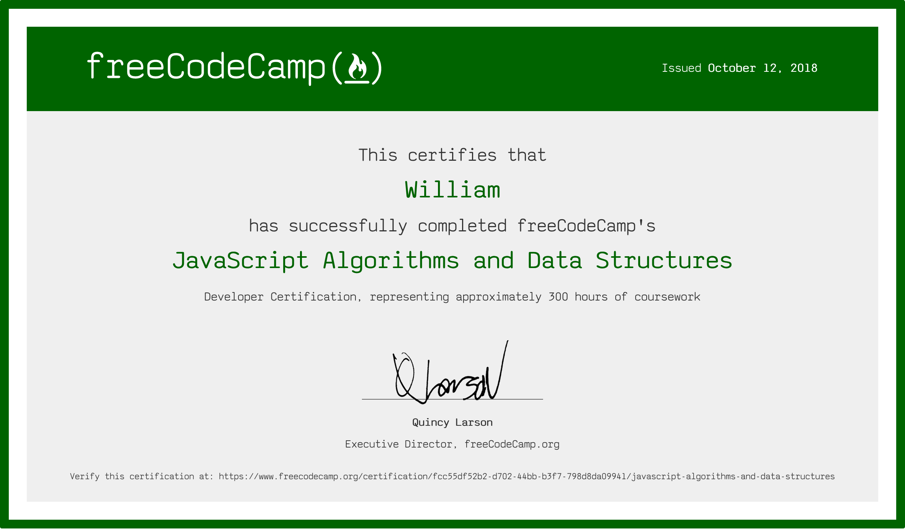

# freeCodeCamp Javascript Algorithms And Data Structures Final Projects

This repository contains the five projects I made for the Javascript Algorithms And Data Structures certificate on freeCodeCamp.org. Through these projects, I learned how to use JavaScript ES6 syntax, regex patterns, and focused on using functional programming to solve the challenges.

